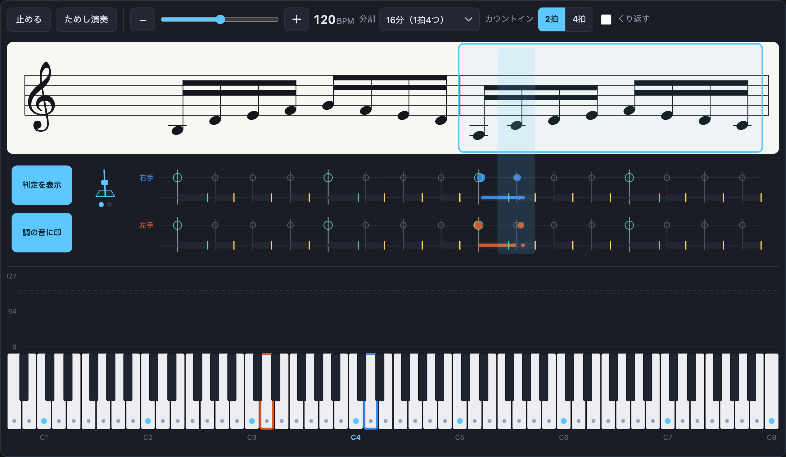
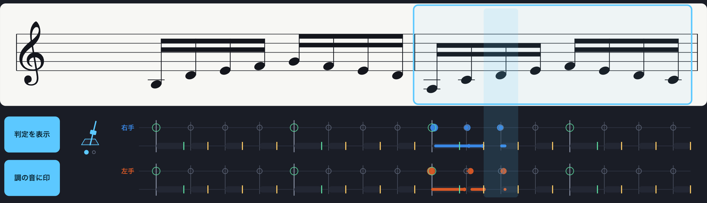
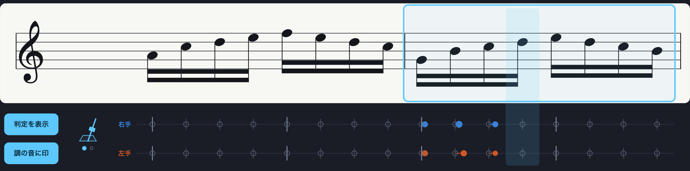
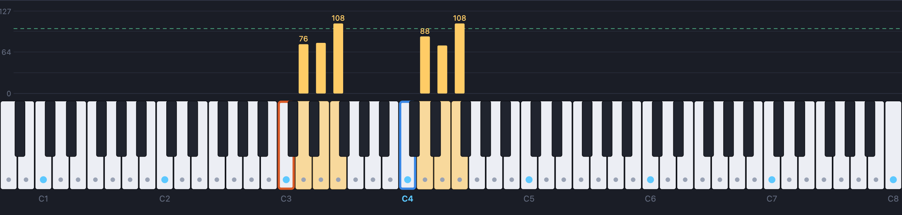
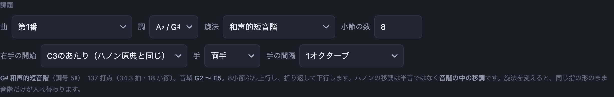
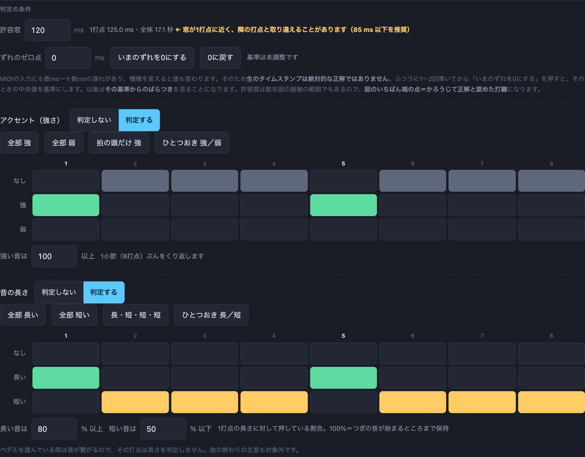
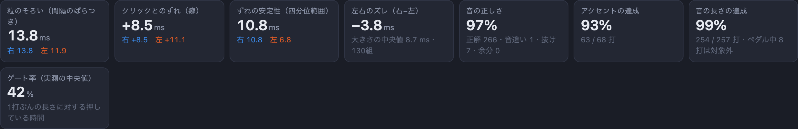
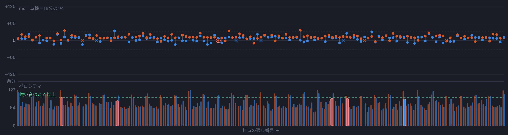
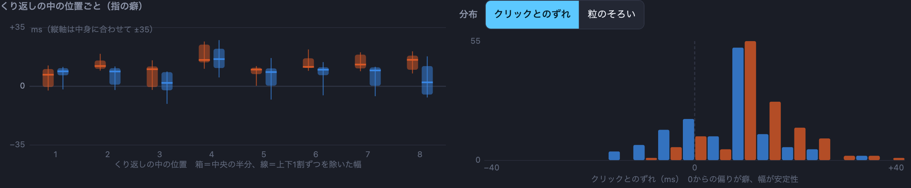
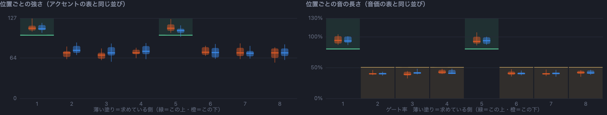

# ハノントレーナー（MIDI）

**― リズム・強さ・長さを測る**

電子ピアノをつなぎ、**メトロノームに合わせてハノンや音階を弾き、リズムの正確さと音量を見る**ためのツールです。弾く音は**楽譜が自動で組まれて**画面に出ます。ブラウザだけで動きます。

**→ アプリ　https://ku-ron.github.io/hanon_trainer/**

**→ 紹介動画　https://youtu.be/wnLV61NK8i4**



*弾いている最中の画面。上が自動生成した楽譜、その下が判定、いちばん下がベロシティと鍵盤です。*

## 紹介動画

[](https://youtu.be/wnLV61NK8i4)

実際に弾いて判定が出るところまで、動画で見られます。→ https://youtu.be/wnLV61NK8i4

姉妹プロジェクト [ピアノ演奏モニタ](https://github.com/ku-ron/piano_monitor)（弾いたものをそのまま映す）、[コード弾き練習 MIDI Ver.](https://github.com/ku-ron/chord_practice_midi)（コードを弾けたか見る）に続く3つめで、MIDIのつなぎ方・メトロノームの鳴らし方はそのまま同じです。こちらが見るのは **「同じ感覚で弾けているか」** です。

---

## ⚠ iPad・iPhone では専用ブラウザが要ります

**Safari は Web MIDI API に対応していません。** iOSはすべてのブラウザがWebKitを使うため、iPad版のChromeを入れても同じです。

| 環境 | どうするか |
|---|---|
| Mac / Windows | **Chrome、Edge、Firefox 108+** でURLを開くだけ |
| iPad / iPhone | **MIDIWeb Browser**（無料）でURLを開く |
| Mac版Safari | MIDIは動きません（「ためし演奏」だけ動きます） |

MIDIが無くても **「ためし演奏」** ボタンで動きを確かめられます。わざと少しよれた演奏を作って、実機とまったく同じ判定経路に流します。

---

## つなぎ方

```
電子ピアノ ──(Bluetooth MIDI または USB)──→ 端末     判定用のデータ
端末 ──(MIDI)──→ 電子ピアノ                          メトロノームのクリック
電子ピアノ ──(ヘッドホン・内蔵スピーカー)──→ 耳      弾いた音とクリック
```

**クリックは電子ピアノ自身に鳴らしてもらってください。** 端末の内蔵スピーカーで鳴らすと、出力までの遅れ（内蔵で20ms程度、Bluetoothオーディオなら150〜250ms）がそのまま「ずれ」に化けます。MIDIで鳴らせば数msで済みます。

Bluetooth **オーディオ**は使わないでください。名前は似ていますが Bluetooth MIDI とはまったく別の技術です。

---

## このアプリが見ている2つの「ずれ」

ここがこのアプリの考え方の中心です。

### 1. 粒のそろい（隣の音との間隔）— こちらが主

隣り合う打鍵の間隔が、あるべき間隔からどれだけ外れたか。**ハノンで見たいのはほぼこれです。**

### 2. クリックとのずれ — こちらは従

メトロノームが鳴る時刻からどれだけ離れて打鍵したか。

**全体が20ms遅れているが完全に均等な演奏は「良いハノン」です。** クリックとのずれだけを見ていると、これを「悪い」と表示してしまいます。逆に、平均すればクリックにぴったりでも一音ごとに前後に揺れている演奏を「良い」と見てしまいます。だからこの2つを最初から別の量として持ち、成績のいちばん左に「粒のそろい」を置いています。

---

## 画面

上から **設定 / 演奏モニタ / 結果** の3段です。

- **設定**（たためます）… 課題・メトロノーム・判定の条件。決めたら折りたたむと、モニタが画面の上に来ます
- **演奏モニタ** … 開始ボタン・テンポ・楽譜・ベロシティ・鍵盤。弾いている最中に見るものだけが、ここにまとまっています。テンポはスライダーと **−／＋** で決めます（数字を打つのは、特にタブレットでは難しいため）。カウントインは **2拍／4拍**
- **結果** … 止めてから見る図

### 楽譜（2小節ぶん・位置は動きません）

鍵盤の上に、いま弾く音の楽譜が出ます。**2小節ぶんが左右に並んでいて、位置は動きません。**

```
                          ┏━━ いま弾いている小節 ━━┓
 ┌──────────────────────────┬─────────────────────────────────┐
 │  8va - - - - - - - - - - - - - - - - - - - - - - - - - - ┐ │
 │𝄞 ♯♯♯♯♯  ♪ ♪ ♪ ♪ ♪ ♪ ♪ ♪  │ ♪ ♪ ♪ ♪ ♪ ♪ ♪ ♪                 │
 └──────────────────────────┴─────────────────────────────────┘
  右手  ┊ ┊─● ┊● ┊ ┊─● …    ← 目盛り＝あるべき位置、右へ伸びる＝遅れ
  左手  ┊─● ┊──●┊─● ┊──● …
```

いま弾いている小節の隣にはつぎの小節が出ていて、そこへ進むと、**弾き終わった側だけ**がその先の小節に入れ替わります。譜面が横に流れないので、目の置きどころが動きません。



*青い枠がいま弾いている小節。青い帯がいま弾く音。その下が判定の段です。*

**どちらを弾いているかは枠で示します。** 弾いている側の小節を青い枠で囲み、地色をわずかに変えてあります。囲うのは**音符の場所だけ**で、左端の音部記号と調号は含めません（含めると左右の小節で幅も意味も揃わないためです）。**文字は一切出しません**（出た瞬間にその高さぶん下がずれるためと、演奏中は譜面から目を離せないためです）。いま弾く音そのものは青い帯が指しています。

**音符は2小節を通してぴったり等間隔に並びます。** 音部記号と調号は段の左端に1回だけ置いてあります（本来の楽譜と同じ置き方です）。小節ごとに置くと、そのぶん右の小節が押されて、小節をまたぐところだけ間隔が空いてしまうためです。下のずれの段と横位置が一致するので、拍の等間隔がそのまま目盛りになります。

**弾いている間、画面はどこも動きません。** そのために2つ決め打ちにしてあります。

- **縦幅**は、曲を通していちばん要る高さを最初に全小節ぶん計算して固定します。小節ごとに高さを詰めると、音が高いところへ来るたびに譜面もその下の段も上下して、目で追えなくなるためです
- **調号の場所**は、いくつ付く調でも「7つぶん」で取っておきます。実際の数で詰めると、調を変えるたびに音符とその下の目盛りが左右に動いて、音の間隔の感覚が狂います

**譜面は画面幅に合わせて組み直します。** 五線の大きさは、横に入るぶんだけ大きく（「打点の間隔が符頭1.5個ぶんは空く」を満たす最大の大きさ、上限つき）。iPad mini の縦画面（744px）でも横スクロールは出ません。

- **楽譜は1段だけ**です。両手のときは右手ぶんを出します（左手は同じ音度をオクターブ下で弾くだけなので、段を2つ並べても同じ形が2回出るだけになります）。片手だけを選んだときは、その手のぶんを出します。**1段にしたぶんの幅と高さを、音符そのものの大きさに回しています**
- **音部記号とオクターブ記号（8va・8vb、必要なら15ma・15mb）は、見えている2小節の音域を見て、加線がいちばん少なくなる組み合わせを選びます。** ハノンやスケールは上行しきると4オクターブ近く動くので、これが無いと加線だらけになって枠からはみ出します。加線1〜2本は咎めず、そこから先を強く嫌う勘定にしてあるので、記号が付くのは本当に必要なときだけです（第1番を通しで弾くと、31小節のうち切り替わるのは2回）。決め方はその小節の音だけで完結するので、同じ小節ならいつでも同じ見た目になります

  

  *第1番を上行しきったあたり。加線だらけになるので 8va が入り、音符は五線の中に収まります。*
- 譜面の下が **リズムのずれ**です。既定で出ますが、「判定を表示」で消せます
  - **上が右手、下が左手**の2段。重ねると点が隠れ合うので分けてあります
  - 横軸は時間。**縦の目盛りがあるべき打鍵位置**（音符の真下）で、そこから点までの細い髭が**タイミングのずれ**。**右へ伸びていれば遅れ、左へ伸びていれば先走り**
  - 弾いている最中のこの段だけは**時間そのものが横軸**なので「右＝遅れ」です。止めてから見る下の「結果」の図は縦軸で、そちらは**「上＝遅れ」**になります
  - **目盛りの間隔がそのまま1打点ぶんの時間**です
  - **点の大きさ＝強さ**（ベロシティ）
  - **音の長さも判定するときだけ、手ごとに2段**になります（上＝打鍵と強さ、下＝音の長さ）。判定しないときは1段のままです
  - 上下の段で点の位置を見比べると、**左右のズレ**がそのまま分かります
  - この段とベロシティの段は目盛りが別なので、間に区切り線を入れてあります
  - 左端の空き（音部記号と調号のぶんレーンが右に寄ってできる場所）に、**「判定を表示」「調の音に印」の切り替え**と、**メトロノームの振り子**を置いてあります。演奏中に上の設定まで戻らずに済みます

### メトロノームの振り子

譜面の左下で振り子が振れます。クリックを内蔵スピーカーで鳴らすと聞き取りにくいので、**目でも拍が取れる**ようにするためです（コード弾き練習アプリと同じ作りです）。

- 片道が1拍。両端で速度が0になるので、実物の振り子のように見えます
- 下の点が**小節の中の何拍目か**。いま鳴った拍が脈打ちます
- カウントイン中は残り拍数が数字で出ます
- 角度はCSSアニメーションではなく**音の時計から毎フレーム引き直します**。譜面は拍以外の理由でも組み直されるので、アニメーションだと描き直しのたびに頭へ戻って跳ねてしまいます

**演奏モニタに説明の文字は置いていません。** 打点数や残り拍のような出たり消えたりする文字はレイアウトを動かしますし、凡例のような固定の文字も、限られた縦幅をそのぶん食うためです（読み方はこのREADMEにあります）。

#### 薄い「的」と、外れたときの✕

弾く前から、**あるべき姿が薄い印で出ています**。実際に弾いたものをそこへ重ねます。

```
上段（打鍵と強さ）      ○     ← 的：あるべき丸の大きさ
                      ┊       緑＝この大きさ以上（強）／橙＝この大きさ以下（弱）／灰＝指定なし
                      ┊─●    ← 実際：髭がずれ、丸の大きさが強さ。外れたら ✕

下段（音の長さ・指定したときだけ）
                      ┃━━━━┃ ← 的：あるべき長さの帯と、その端の線
                      ┃━━━●  ← 実際：押していた長さ。末尾に丸（合格）か ✕（外れ）
```

- **色の意味はどちらの段でも同じ**です。**緑＝この線まで届けば合格**（強く／レガート）、**橙＝この線までで止めれば合格**（弱く／スタッカート）
- **✕は手の色のまま、形だけが変わります**（赤は左手の色と紛らわしいので使いません）
- うまく弾けているあいだは✕が出ないので、画面が静かなままです
- 上段の的の輪郭は**いちばん上に描いています**。大きく弾いた点に隠れると、大きさを比べられなくなるためです

音の綴りは音度から決まるので、迷いがありません。教会旋法はどれも長音階の回転なので**必ず調号にぴたりと収まり、臨時記号は出ません**。和声的短音階・旋律的短音階だけ、変化した音に臨時記号が付きます（G♯短調なら 7度が F𝄪 になります）。

### ベロシティと鍵盤

鍵盤の**真上に、鳴っている音のベロシティが棒グラフ**で出ます。鍵の位置にそのまま合わせてあるので、どの音をどれだけの強さで弾いたかが一目で分かります。

- **青** … いま指で押している音　**黄** … 指は離したがペダルでまだ鳴っている音
- 同じ音を鳴っているうちに弾き直したときは、**大きいほうのベロシティが残ります**
- アクセントの判定を入れていると、閾値の線も引かれます
- 鍵盤には、選んだ調の音に印が付きます（主音は濃い色）。青い縁取りが**つぎに弾く音**です



*ペダルを踏んでいるところ。黄色が「指は離したがペダルで鳴っている音」です。青い縁取りが右手、橙が左手の「つぎに弾く音」。白鍵の点が選んだ調の音です。*

### 課題

| 項目 | 中身 |
|---|---|
| 曲 | ハノン第1部（1〜20番）、スケール、3度、6度、アルペジオ（三和音・七の和音）、分散和音 |
| 調 | 12種 |
| 旋法 | イオニア（長調）・ドリア・フリギア・リディア・ミクソリディア・エオリア（自然的短調）・ロクリア・和声的短音階・旋律的短音階 |
| 長さ | ハノンは**小節の数**（既定14＝原典と同じ長さ）、音階類は**オクターブ数**（既定2。上行2オクターブ＋下行2オクターブ）。同じ入力欄ですが、値は種類ごとに別々に覚えます |
| 右手の開始 | 既定は **C3のあたり**。ハノン第1部の原典は右手も中央ハより1オクターブ下から始まり、途中までヘ音記号で書かれています |
| 手 | 両手 / 右手だけ / 左手だけ。間隔は1〜2オクターブ |

**ハノンの移調は半音単位ではなく「音階の中の移調」です。** 譜面を音の並びではなく**音度の並び**で持っているので、調を変えても旋法を変えても同じ指の形のまま音階だけが入れ替わります。教会旋法が入っているのはこの作りの副産物です。



*設定はたためます。決めてしまえば、演奏中に見るのは下のモニタだけです。*

### 判定の条件

判定の条件は、見るものが違う3つに区切ってあります。

**1. タイミング**

- **許容窓** … これより離れた打鍵は、その音のものと認めません。**散布図の縦軸の範囲でもある**ので、図のいちばん端の点＝かろうじて正解と認めた打鍵になります。1打点の長さに近づくと隣の打点と取り違えるおそれがあるので、そのときは画面が知らせます
- **ずれのゼロ点** … 下の「基準合わせ」を参照。許容窓と同じ話なので隣に置いてあります

**2・3. アクセント（強さ）と音の長さ**

どちらも「判定しない／判定する」で切り替えます。**判定しないあいだは表もひな型も出しません**（画面を静かに保つため）。
- **アクセント** … **1打点ずつ、強・弱・なしを表で指定します。** 縦は1列につき1つだけ選べます

  ```
        1  2  3  4  5  6  7  8      ← 1小節ぶん（ここではハノンの8打点）
  なし  □  ■  □  ■  □  □  ■  □
  強    ■  □  □  □  ■  □  □  □      ← ここが閾値以上なら達成
  弱    □  □  ■  □  □  ■  □  ■      ← ここが閾値以下なら達成
  ```

  この1小節ぶんをくり返して当てます。ひな型は「全部 強」「全部 弱」「拍の頭だけ 強」「ひとつおき 強／弱」。**「拍の頭だけ 強」は、頭以外を「なし」にします**（弱く弾け、という指示にはしたくないため）。あとは1マスずつ触れます。**強が1つでもあるときだけ強の閾値、弱が1つでもあるときだけ弱の閾値**が、ベロシティの表示に線として出ます。「なし」の打点は音量を見ません（既定は強 100以上／弱 60以下）

- **音の長さ**（スタッカート／レガート）… **同じ形の表をもう1つ**。強さと組み合わせられる（強くて短い、など）ので独立しています

  ```
        1  2  3  4  5  6  7  8
  なし  ■  □  ■  □  ■  □  ■  □
  長い  □  □  □  □  □  ■  □  ■      ← ゲート率が閾値以上ならレガート
  短い  □  ■  □  ■  □  □  □  □      ← ゲート率が閾値以下ならスタッカート
  ```

  ひな型は「全部 長い」「全部 短い」「長・短・短・短」（拍の頭だけ長い）「ひとつおき 長／短」。

  **ゲート率＝(離鍵−打鍵)÷1打点の長さ**。既定は**長い ≥ 80%／短い ≤ 50%**です。100%は「つぎの音が始まるところまで保持」で、レーンでは**バーの長さが目盛り1つぶん**にあたります。閾値もアクセントと同じで、使う側だけ出ます

  判定しないもの：**ペダルを踏んでいた打点**（音が繋がるので指の長さを測れない。除いた数は成績に出ます）、**曲の終わりの主音**（原典でも長い音）、まだ離していない音



*上からタイミング（許容窓とゼロ点）、アクセント、音の長さ。「判定する」を押すまで表もひな型も出ません。*

### 基準合わせ（これは必ず一度やってください）

MIDIの入力にも数ms〜十数msの遅れがあり、機種を変えると値も変わります。**生のタイムスタンプは絶対的な正解ではありません。**

ふつうに1〜2回弾いてから **「いまのずれを0にする」** を押すと、そのときの中央値を基準にします。以後見ているのは **その基準からのばらつき** です。これをやらずに「+15ms遅れている」と言われても、それが自分の癖なのか機材の遅れなのか分かりません。

---

## 結果の見かた

### ダンベル散布図（主図）

横軸＝打点の通し番号、縦軸＝ずれ（ms）、0の線が正解。**同じ打点の右手と左手を細い縦線でつないであります。**

- **縦軸は「上ほど遅い」**です。0の線より**上に出た点は、あるべき時刻より遅れて弾いた音**、**下に出た点は先走った音**。軸の数字も上が＋、下が−になっています
- **縦線の長さがそのまま左右のズレ**です。左右差の専用グラフを作らずに、いちばん見たい量が主図の中に出ます
- 点の群れが全体として上へ寄っていけば「もたっている」、下へ寄っていけば「走っている」ということです
- 抜けは0の線の上に **×**、余分な打鍵は図の外の細い帯に出します。余分な打鍵に「ずれ」は定義できないので、正解の点と同じ縦軸には混ぜません
- 音を間違えた打鍵は赤い輪で囲みます（色は左右のために使っているので、輪郭で分けています）

下の段は**同じ横軸のベロシティ**です。閾値の線を引いてあるので、上下を見比べれば「強く弾いた音だけ遅れている」が分かります。





*上がずれ、下が同じ横軸のベロシティ。丸が右手と左手で、縦線でつないであります。*

### くり返しの中の位置ごと（指の癖）

ハノンは同じ形を1小節ずつくり返す曲なので、**くり返しの中の何番目かで集計すると指の癖がそのまま出ます**（ハノンならくり返しの単位は1小節＝8打点、音階なら1オクターブぶん）。「4番目だけ遅れて、しかもばらつく」が一目で分かります。箱が中央の半分、線が上下1割ずつを除いた幅、太い横線が中央値です。

**縦軸の向きは主図と同じで、上ほど遅いです。** 0の線より**上に出ている位置は、そこだけ遅れている**（指が転ばずに置き遅れている）、**下に出ている位置は、そこだけ先走っている**ということです。箱の縦幅が広い位置は、遅れたり早まったりが安定していない位置です。

たとえば「4番目の箱だけ上へ出ていて、しかも縦に長い」なら、**4番目の指がいつも少し遅れ、しかもばらついている**、と読みます。

位置は運指とほぼ対応しますが同一ではありません（下行で運指が変わるため）。そのため「位置」と呼んでいます。

この図だけ**縦軸を中身に合わせて拡大**します。位置どうしの差は許容窓よりずっと小さいことが多く、窓に合わせると箱が潰れて読めないためです。軸に範囲を書いてあります。

### 分布

「クリックとのずれ」と「粒のそろい」を切り替えられます。0からの偏りが癖、幅が安定性です。

**こちらは横軸で、右ほど遅いです。** 山が0より右に寄っていれば全体に遅れ気味、左に寄っていれば走り気味。山の幅が狭いほど安定しています。



### 位置ごとの強さ・音の長さ

**アクセントと音価も、表の列ごとに集計します。** 「1拍目のアクセントは出せているが5拍目が甘い」「3番目のレガートだけ届いていない」といったことが、指定した場所と並べて見られます。

- 横は**アクセント／音価の表と同じ列**（1小節の中の位置）。上のリズムの図が「くり返しの中の位置」なのに対し、こちらは表と揃えてあります
- 縦はベロシティ（0〜127）とゲート率（%）の実測。**上ほど強い／上ほど長い**です。箱と線の意味はリズムの図と同じです
- **薄く塗ってあるのが求めている側**です。緑＝この線より上、橙＝この線より下。箱がその塗りの中に収まっていれば合格です
- それぞれ、判定を入れているときだけ出ます



*薄く塗ってあるのが求めている側。箱がその中に収まっていれば合格です。この例では1・5拍目に強と長を指定していて、そこだけ値が持ち上がっています。*

---

## プリセットの素性

ハノン第1部（1〜20番）の音の並びは、[Mutopia Project](https://www.mutopiaproject.org/) が公開している LilyPond 版（Hanon 1873・パブリックドメイン）から1音ずつ読み出し、音度に直してあります。

その数値から楽譜を組み直して原典と突き合わせた結果は次のとおりです。

- **20曲中14曲は全音一致**（第1・2・3・4・5・7・8・10・11・13・14・16・18・19番）
- 残り6曲（第6・9・12・15・17・20番）も、上行から下行への**折り返しや締めくくりの1〜4音**だけの差です。原典がそこで形を崩している箇所で、こちらは規則どおりに続けます
- 第12番だけ、原典の1小節目の最高音が2小節目以降の規則から外れています（原典の版ゆえの揺れと思われます）。こちらは規則のほうを採っています

小節の数を変えても崩れないように、下行の開始位置は「上行最後の小節からのずれ」として持っています。既定値（14小節）で弾くと原典と同じ長さになります。

---

## 楽譜の作り（ライブラリは使っていません）

VexFlow・abcjs・OSMD などの楽譜ライブラリは使っていません。**素の SVG を組み立てているだけ**です。

- **音部記号・調号・変化記号の字形**だけ、[Bravura](https://github.com/steinbergmedia/bravura)（MuseScore 同梱の楽譜フォント、SIL OFL 1.1）から必要な字の輪郭を取り出して埋め込んでいます。姉妹プロジェクト「ピアノ演奏モニタ」と同じものです。フォントの読み込みを待たずに済み、環境によって字形が変わることもありません
- **五線・符頭・符尾・連桁・加線**は、ただの `rect` と `ellipse` です。符頭は楕円を21度傾けたもの、連桁は水平な長方形
- **音の位置**は、譜面を音度で持っているところから直に出ます。「音度が7つ進めば1オクターブ、五線の段も7つ上がる」という対応がそのまま使えるので、五線の段は `主音の段 + 音度` の1行で決まります。**同じ黒鍵を F♯ と書くか G♭ と書くかで迷う余地がありません**

ライブラリを避けたのは、必要なのが「16分音符が8つ並んだ小節を2つ」だけで、汎用の記譜エンジンが持っている機能（複数声部・連符の入れ子・歌詞・強弱・リピート）を一切使わないからです。全部で200行ほどで済んでいます。

## 分かっている制限

- **手の間隔を「同じ高さ（ユニゾン）」にすると左右を見分けられません。** MIDIには「どちらの手で弾いたか」の情報が無く、鍵が同じだと区別する手がかりが消えます。片手ずつ弾くか、間隔を1オクターブ以上にしてください
- **許容窓を1打点の長さに近づけると、隣の打点と取り違えることがあります。** 1打点の7割くらいまでを目安にしてください（画面が知らせます）
- 同じ音を鳴っているうちに弾き直すと、離鍵の対応が1つぶん失われます（ゲート率だけの話で、リズムの判定には影響しません）
- 記録は演奏を開始するたびに消えます。1回ぶんの演奏を見るための道具です
- **楽譜の下のずれの帯に残るのは、いま弾いている小節のぶんだけです。** 弾き終わった小節はすぐ先の小節に入れ替わるので、そこに出ていた点も消えます。ふりかえりは下の「結果」で見てください
- 楽譜は**上行と下行を同じ形で並べた練習用の組み方**で、原典の浄書（強弱記号・運指・段の割り方）は再現していません
- **レガート合格の帯は、隣の音の的に重なります。**仕様です（100%＝つぎの音が始まるところなので、それ以上ならはみ出します）
- 下段に出るのは**長さを指定した打点だけ**です。指定していない打点は判定しないので、帯も出しません
- レガートは本来「前の音のオフとつぎの音のオンの重なり」で測るのが厳密ですが、**表示と判定を同じ量にそろえたい**のでゲート率1本にしています。差はタイミングのずれぶん（±数十ms）です
- **楽譜は1段だけなので、左右で違う音を弾く課題は表示できません。** いまは左手が右手のオクターブ下（またはユニゾン）に限られているので困りませんが、たとえば「左手を3度ずらす」ような課題を足すときは、大譜表に戻す必要があります

---

## 設定の保存

曲・調・旋法・テンポ・閾値・基準合わせの値は、ブラウザに保存されて次回も残ります。
